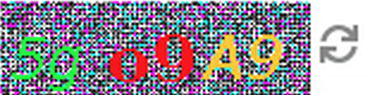

# j-basic-captcha
Java Basic Captcha

It creates Captchas based on a TOTP (RFC6238) implementation (https://github.com/damico/JavaOTP). In other words the captcha image is an OTP (even with letters), created using a shared secret.

Take a look at the main unit test to understand how it works: https://github.com/damico/j-basic-captcha/blob/master/jbasiccaptcha/src/test/java/org/damico/jbasiccaptcha/GeneratorTest.java
